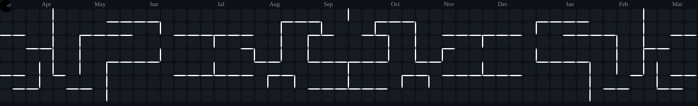

<h1 align="center">
  
</h1>

# 💫 About Me:
Suresh Jayachandhiran is a Graphic Designer and Web Designer specializing in UI/UX design, branding, and modern visual experiences. Explore his creative portfolio and design projects.

## 🌐 Socials:

# 💻 Tech Stack:

## 🎮 Fun Corner: SVG Games

---

<!-- Proudly created with GPRM ( https://gprm.itsvg.in ) -->
